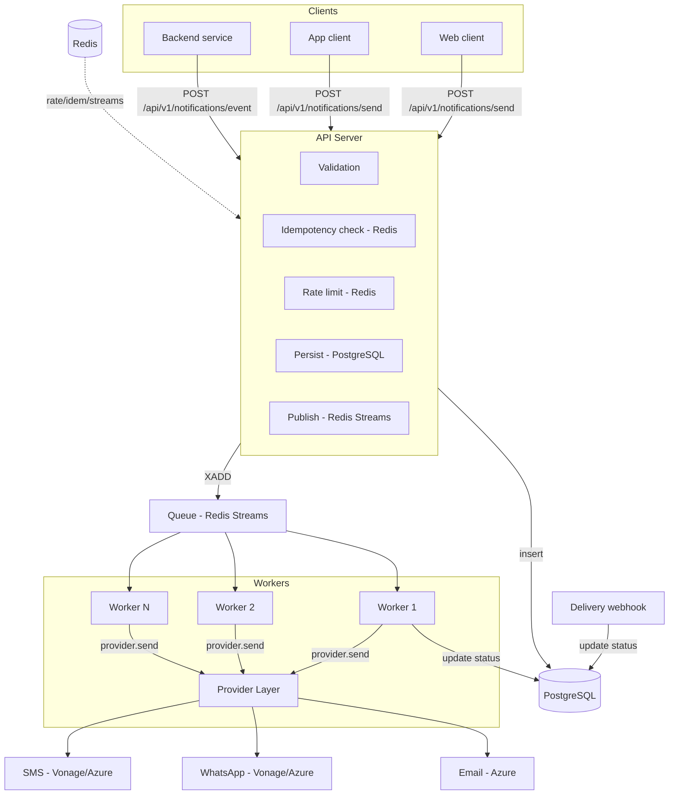
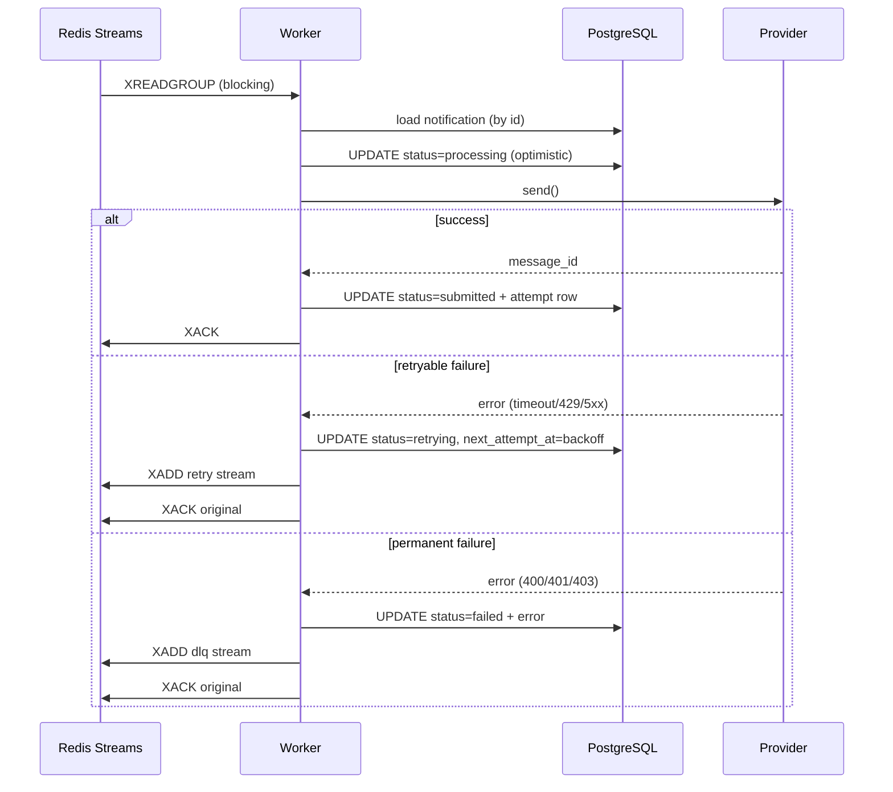
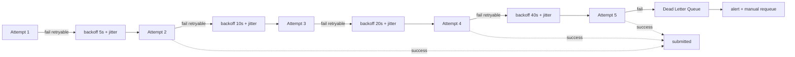
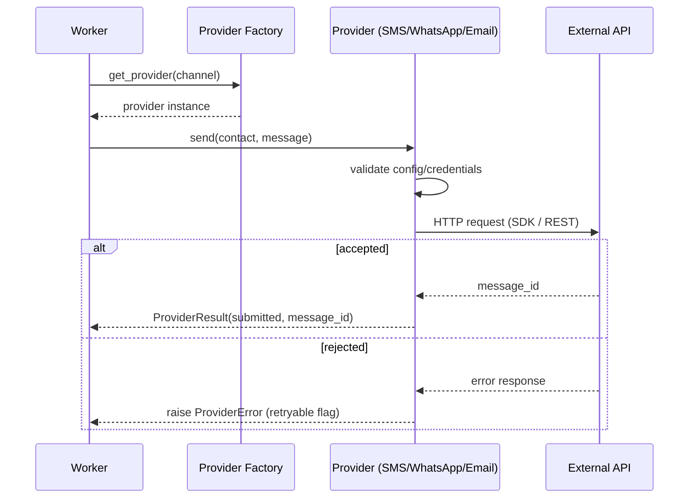

# 01 — Architecture

## 1.1 Current Architecture

The Notification Service is a single-process **FastAPI** application (Python 3.12)
backed by **SQLite** with in-process background dispatch via `FastAPI.BackgroundTasks`.

```
Client
  ↓ HTTP + JSON
FastAPI (single process, BackgroundTasks)
  ├── app/routers/v1.py          → /api/v1/*
  ├── app/routers/notifications.py → legacy /send, /status
  ├── app/routers/webhooks.py    → /api/v1/whatsapp/webhook
  ├── app/orchestrator.py        → fan-out, DB insert, BackgroundTasks dispatch
  ├── app/providers/factory.py   → channel → provider mapping
  ├── app/providers/vonage_provider.py → VonageSMS (SDK), VonageWhatsApp (HTTP)
  ├── app/providers/azure_provider.py → AzureSMS/Email/WhatsApp (SDKs)
  └── app/database.py            → SQLite (single messages table)
```

**Limitations of the current architecture:**

| Area | Limitation |
| ---- | ---------- |
| Processing | In-process `BackgroundTasks` — no durability; if the process crashes mid-send, the message is lost. |
| Database | SQLite — single-writer, no concurrency, no read replicas, no HA. |
| Queue | None — no decoupling between API and delivery. |
| Workers | Same process as API — no independent scaling, no isolation. |
| Retries | None — one attempt, failure is terminal. |
| Idempotency | None — duplicate API requests produce duplicate sends. |
| Throttling | None — no rate limiting at any layer. |
| Caching | None — every status lookup hits the DB. |
| Observability | Basic plain-text logging — no metrics, no structured logs, no tracing. |
| Containers | No Dockerfile, no docker-compose. |
| CI/CD | None. |

## 1.2 Target Architecture

```
                        ┌───────────────┐
                        │   Client(s)   │
                        └───────┬───────┘
                                │ HTTP + X-API-Key + idempotency-key
                                ▼
┌──────────────────────────────────────────────────┐
│             API Server (FastAPI)                  │
│  ┌────────────────────────────────────────────┐  │
│  │ 1. Validate request (schema + contact)      │  │
│  │ 2. Check idempotency (Redis)                │  │
│  │ 3. Rate-limit (Redis)                       │  │
│  │ 4. Persist to PostgreSQL (status=queued)    │  │
│  │ 5. Push to queue (Redis Streams)            │  │
│  │ 6. Return 202 with notification_id          │  │
│  └────────────────────────────────────────────┘  │
└───────────────────────┬──────────────────────────┘
                        │
                        ▼
             ┌──────────────────┐
             │   Redis Streams  │ (message queue)
             │   (consumer grp) │
             └───────┬──────────┘
                     │
                     ▼
┌──────────────────────────────────────────────────┐
│              Worker (one or more)                 │
│  ┌────────────────────────────────────────────┐  │
│  │ 1. XREADGROUP (blocking)                    │  │
│  │ 2. Claim / ack                              │  │
│  │ 3. Load notification from PostgreSQL         │  │
│  │ 4. Check idempotency (Redis)                │  │
│  │ 5. Update status → processing               │  │
│  │ 6. Select provider via factory              │  │
│  │ 7. Send via provider                        │  │
│  │ 8. Update status → submitted / failed       │  │
│  │ 9. If retryable → schedule retry (push back)│  │
│  │ 10. XACK                                   │  │
│  └────────────────────────────────────────────┘  │
└───────────────────────┬──────────────────────────┘
                        │
                        ▼
┌──────────────────────────────────────────────────┐
│           Provider Layer (abstraction)            │
│  ┌──────────┬──────────────┬──────────────────┐  │
│  │ SMS      │ WhatsApp     │ Email            │  │
│  │ Vonage   │ Vonage Sand. │ Azure            │  │
│  │ Azure    │ Azure        │                  │  │
│  └──────────┴──────────────┴──────────────────┘  │
└───────────────────────┬──────────────────────────┘
                        │
                        ▼
┌──────────────────────────────────────────────────┐
│  PostgreSQL (durable source of truth)             │
│  ┌────────────────────────────────────────────┐  │
│  │ notifications, notification_attempts,       │  │
│  │ notification_events, idempotency_keys,      │  │
│  │ webhook_events                              │  │
│  └────────────────────────────────────────────┘  │
└──────────────────────────────────────────────────┘
                        │
                        ▼
┌──────────────────────────────────────────────────┐
│  Redis (supporting, NOT the source of truth)      │
│  ├── rate limiting counters + sliding window      │
│  ├── idempotency key cache (fast path)            │
│  ├── recently-processed keys (TTL)                │
│  └── distributed locks (if needed)                │
└──────────────────────────────────────────────────┘
```

## 1.3 Component Responsibilities

| Component | Responsibility |
| --------- | -------------- |
| API Server | Validate requests, check idempotency, rate-limit, persist to PostgreSQL, enqueue to Redis Streams, return 202. |
| Redis Streams | Durable message queue with consumer groups, at-least-once delivery, dead-letter via separate stream. |
| Worker | Consume from queue, select provider, send, update DB, retry on failure, ack. One worker process per channel or shared pool. |
| Provider Layer | Abstract interface for all channels. Isolate external API details. Map errors to retryable/non-retryable. |
| PostgreSQL | Durable source of truth for all notification state, attempts, events, idempotency. |
| Redis | Ancillary support: rate limiting counters, idempotency key cache, temporary locks. Never the primary data store. |

## 1.4 Why Each Component

| Component | Rationale |
| --------- | --------- |
| **API + Queue + Workers** | In-process `BackgroundTasks` are not durable — a crash loses the message. A queue decouples API availability from delivery. Workers scale independently. |
| **PostgreSQL** | SQLite cannot handle concurrent writes from API + workers + webhooks. PostgreSQL provides MVCC, read replicas, connection pooling, and production durability. |
| **Redis** | Rate limiting and idempotency checks need sub-millisecond access. Redis is ideal for these transient, TTL-bounded data. Never the source of truth. |
| **Redis Streams** (queue) | Redis is already needed for rate limiting. Adding a separate queue broker (RabbitMQ) adds another runtime (Erlang) and operational surface. Redis Streams provide consumer groups, acks, and dead-letter streams with no new infrastructure. |
| **Provider abstraction** | New channels (Push, Telegram, Slack) must be addable without touching the core orchestrator or queue. The `NotificationProvider` ABC enforces this contract. |

## 1.5 Request Lifecycle

```
1. Client → POST /api/v1/notifications/send
   Headers: X-API-Key, Idempotency-Key
2. API server validates (schema, contact, channels)
3. Check idempotency key in Redis (if exists, return previous result)
4. Check rate limits (Redis)
5. Insert notification into PostgreSQL (status=queued)
6. Push message to Redis Stream (channel-specific stream)
7. Return 202 { notification_id, status: queued }
8. Worker (blocking XREADGROUP) receives the message
9. Worker loads notification from PostgreSQL
10. Status → processing
11. Worker calls provider.send()
12. Provider returns message_id (or raises)
13. Status → submitted / failed
14. Insert notification_attempt row
15. If retryable and attempts < max → push to retry stream (with delay)
16. XACK the stream message
```

## 1.6 Failure Boundaries

| Failure | Boundary | Behavior |
| ------- | -------- | -------- |
| Queue unavailable | API → queue | API returns 503. Messages remain in PostgreSQL (queued). Workers cannot pick them up. |
| PostgreSQL unavailable | API → DB | API returns 503. Cannot enqueue. Webhook cannot update status. |
| Redis unavailable | API → Redis | Rate limiting and idempotency degrade to allow (no limit). Queues cannot be consumed. |
| Provider failure | Worker → provider | Worker catches error, classifies as retryable/non-retryable, updates DB, (re)queues or dead-letters. |
| Worker crash mid-send | Queue → worker | Stream message is not ACKed; after `visibility_timeout` another consumer claims it. At-least-once delivery. |
| One channel provider down | Worker → provider | Does not affect other channels. |

## 1.7 Scalability Strategy

| Component | Scale horizontally? | Notes |
| --------- | ------------------ | ----- |
| API Server | Yes | Stateless. Add behind a load balancer. |
| Workers | Yes | Each worker consumes from the same consumer group. Redis Streams distributes messages. |
| PostgreSQL | Read replicas | Connection pooling (PgBouncer). Read replicas for status queries. |
| Redis | Yes (cluster mode) | Rate limiting keys are shardable. |
| Queue | Redis Streams | Consumer groups distribute across workers. Partitioning via stream key (by channel). |

## 1.8 Reliability Strategy

- At-least-once delivery from queue (automatic via consumer group ack semantics).
- Idempotency keys prevent duplicate processing as far as the provider allows.
- Retry with exponential backoff + jitter for temporary failures.
- Dead-letter stream for messages that exhaust retries.
- Graceful shutdown (SIGTERM) — workers finish current message, then exit.
- Connection pooling, timeouts, and circuit breakers on provider calls.
- PostgreSQL is the durable source of truth; Redis can be rebuilt from DB.

## 1.9 Mermaid Diagrams

### 1.9.1 High-level architecture



### 1.9.2 Notification request flow

```mermaid
sequenceDiagram
    participant Client
    participant API
    participant Redis
    participant PG as PostgreSQL
    participant Queue as Redis Streams

    Client->>API: POST /notifications/send (+X-API-Key, Idempotency-Key)
    API->>API: validate (schema + contact)
    API->>Redis: idempotency check
    alt key exists
        Redis-->>API: existing notification_id
        API-->>Client: 202 (X-Idempotent-Replay: true)
    else key missing
        API->>Redis: rate limit check
        API->>PG: INSERT notifications (status=queued)
        API->>Queue: XADD notifications:&lt;channel&gt;
        API-->>Client: 202 {message_id, status: queued}
    end
```

### 1.9.3 Worker flow



### 1.9.4 Failure / retry flow



### 1.9.5 Provider flow

